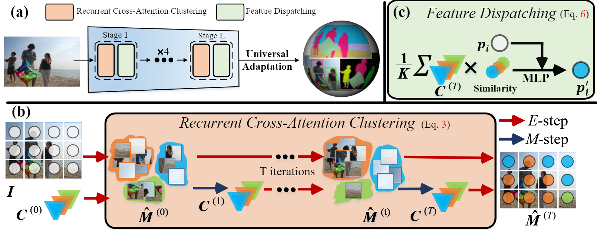

# ClusterFormer: Clustering As A Universal Visual Learner
------

Our [arxiv](https://arxiv.org/pdf/2309.13196.pdf) version is currently available. Please check it out! 🔥🔥🔥

This repository contains the official PyTorch implementation for ClusterFormer: Clustering As A Universal Visual Learner. Our work is built upon [mmclassification](https://github.com/open-mmlab/mmpretrain) and other repos under OpenMMLab framework. We thank the great work of them. 

## Abstract
This paper presents ClusterFormer, a universal vision model that is based on
the CLUSTERing paradigm with TransFORMER. It comprises two novel designs: 1.
recurrent cross-attention clustering, which reformulates the cross-attention mechanism in Transformer and enables recursive updates of cluster centers to facilitate
strong representation learning; and 2. feature dispatching, which uses the updated
cluster centers to redistribute image features through similarity-based metrics, resulting in a transparent pipeline. This elegant design streamlines an explainable
and transferable workflow, capable of tackling heterogeneous vision tasks ($i.e.$,
image classification, object detection, and image segmentation) with varying levels
of clustering granularity ($i.e.$, image-, box-, and pixel-level). Empirical results
demonstrate that ClusterFormer outperforms various well-known specialized
architectures, achieving 83.41% top-1 acc. over ImageNet-1K for image classification, 54.2% and 47.0% mAP over MS COCO for object detection and instance
segmentation, 52.4% mIoU over ADE20K for semantic segmentation, and 55.8%
PQ over COCO Panoptic for panoptic segmentation. For its efficacy, we hope our
work can catalyze a paradigm shift in universal models in computer vision.

<div align="center">
  
</div>
<p align="left">
  Figure 1: (a) Overall pipeline of ClusterFormer. (b) Each Recurrent Cross-Attention Clustering layer
carries out T iterations of cross-attention clustering (E-step) and center updating (M-step) (see Eq. 3). (c) The
feature dispatching redistributes the feature embeddings on the top of updated cluster centers (see Eq. 6).
</p>

## Installation

Below are quick steps for installation:

```shell
conda create -n open-mmlab python=3.8 pytorch=1.10 cudatoolkit=11.3 torchvision==0.11.0 -c pytorch -y
conda activate open-mmlab
pip3 install openmim
mim install mmcv-full
cd clusterformer
pip3 install -e .
```

Please refer to [install.md](https://mmclassification.readthedocs.io/en/latest/install.html) for more detailed installation and dataset preparation.

## Training
We followed the common usage of the mmclassification and check [mmclassification](https://github.com/open-mmlab/mmpretrain) for more training information.

In particular, we use the slurm system to train our model. [Slurm](https://slurm.schedmd.com/) is a good job scheduling system for computing clusters.

On a cluster managed by Slurm, you can use `slurm_train.sh` to spawn training jobs. It supports both single-node and multi-node training.

The basic usage is as follows.

```shell
OMP_NUM_THREADS=1 [GPUS=${GPUS}] ./tools/slurm_train.sh ${PARTITION} ${JOB_NAME} ${CONFIG_FILE} ${WORK_DIR}
```

When using Slurm, the port option need to be set in one of the following ways:

1. Set the port through `--options`. This is more recommended since it does not change the original configs.

   ```shell
   OMP_NUM_THREADS=1 CUDA_VISIBLE_DEVICES=0,1,2,3 GPUS=4 ./tools/slurm_train.sh ${PARTITION} ${JOB_NAME} config1.py ${WORK_DIR} --options 'dist_params.port=29500'
   OMP_NUM_THREADS=1 CUDA_VISIBLE_DEVICES=4,5,6,7 GPUS=4 ./tools/slurm_train.sh ${PARTITION} ${JOB_NAME} config2.py ${WORK_DIR} --options 'dist_params.port=29501'
   ```

2. Modify the config files to set different communication ports.

   In `config1.py`, set

   ```python
   dist_params = dict(backend='nccl', port=29500)
   ```

   In `config2.py`, set

   ```python
   dist_params = dict(backend='nccl', port=29501)
   ```

   Then you can launch two jobs with `config1.py` and `config2.py`.

   ```shell
   OMP_NUM_THREADS=1 CUDA_VISIBLE_DEVICES=0,1,2,3 GPUS=4 ./tools/slurm_train.sh ${PARTITION} ${JOB_NAME} config1.py ${WORK_DIR}
   OMP_NUM_THREADS=1 CUDA_VISIBLE_DEVICES=4,5,6,7 GPUS=4 ./tools/slurm_train.sh ${PARTITION} ${JOB_NAME} config2.py ${WORK_DIR}
   ```

Note that:
- The configs are made for 8-GPU training. To train on another number of GPUs, change the `GPUS`.
- If you want to measure the inference time, please change the number of gpu to 1 for inference.
- We set `OMP_NUM_THREADS=1` by default, which achieves the best speed on our machines, please change it as needed.

## Citation

If you find our work helpful in your research, please cite it as:

```
@inproceedings{liang2023clusterformer,
  title={ClusterFormer: Clustering As A Universal Visual Learner},
  author={Liang, James C and Cui, Yiming and Wang, Qifan and Geng, Tong and Wang, Wenguan and Liu, Dongfang},
  booktitle={Neural Information Processing Systems (NeurIPS)},
  year={2023}
}
```